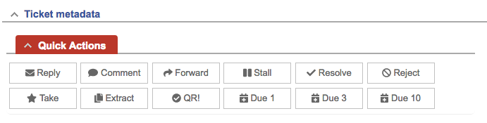

# TicketActions Extension for Request Tracker

#### Table of Contents

1. [About](#about)
2. [License](#license)
3. [Support](#support)
4. [Requirements](#requirements)
5. [Installation](#installation)
6. [Configuration](#configuration)

## About

Provides easy access to frequently used ticket actions:



Also so called follow-up actions set the ticket to status stalled and add a
relative due date with a fixed time. This means that a ticket should be due in x
days. This combination of propertied can be used in searches or escalations to
bring tickets up to users.
In addition holidays of a specific country and specific days of week can be
skipped automatically.

## License

This project is licensed under the terms of
the GNU General Public License Version 2, Copyright held by author.

## Support

For bugs and feature requests please head over to our
[issue tracker](https://github.com/NETWAYS/rt-extension-ticketactions/issues).
You may also send us an email to [support@netways.de](mailto:support@netways.de)
for general questions or to get technical support.

## Requirements

- RT 4.4.2
- Holidays skipping requires the Perl module Date::Holidays and e.g.
  Date::Holidays::DE for German holidays.

## Installation

Extract this extension to a temporary location.

Git clone:

```
cd /usr/local/src
git clone https://github.com/NETWAYS/rt-extension-ticketactions
```

Tarball download (latest [release](https://github.com/NETWAYS/rt-extension-ticketactions/releases/latest)):

```
cd /usr/local/src
wget https://github.com/NETWAYS/rt-extension-ticketactions/archive/v1.0.1.zip
unzip v1.0.1.zip
```

Navigate into the source directory and install the extension.

```
perl Makefile.PL
make
make install
```

Clear your mason cache.

```
rm -rf /opt/rt4/var/mason_data/obj
```

Restart your web server.

```
systemctl restart httpd

systemctl restart apache2
```

## Configuration

| Key                 | Type    | Description                            |
|---------------------|---------|----------------------------------------|
| TA\_FollowUpDays    | Array   | List of follow-up action days,         |
|                     |         | e.g. `[1, 3, 10]` days                 |
| TA\_FollowUpTime    | String  | Time of day when follow-up is reached, |
|                     |         | e.g. `'10:00:00'`                      |
| TA\_HolidaysCountry | String  | Country to skip holidays of            |
|                     |         | (ISO 3361 country code, e.g. `'DE'`)   |
| TA\_SkipDaysOfWeek  | Array   | Days of week to skip,                  |
|                     |         | e.g. `['sat', 'sun']` for the weekend  |

### Full example

```
Plugin('RT::Extension::TicketActions');

Set($TA_FollowUpDays, [1, 3, 10]);
Set($TA_FollowUpTime, '10:00:00');
Set($TA_HolidaysCountry, 'DE');
Set($TA_SkipDaysOfWeek, ['sat', 'sun']);
```
